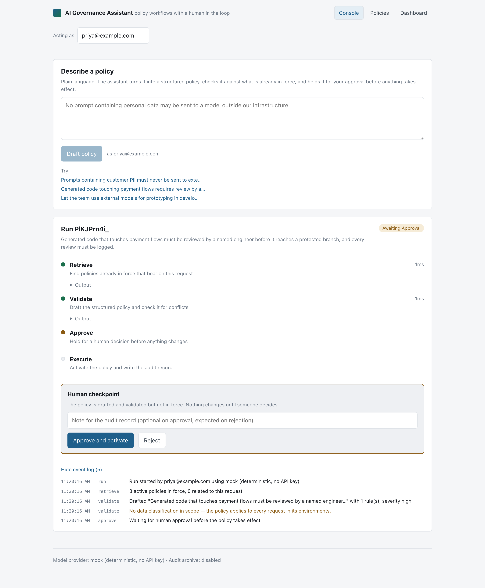
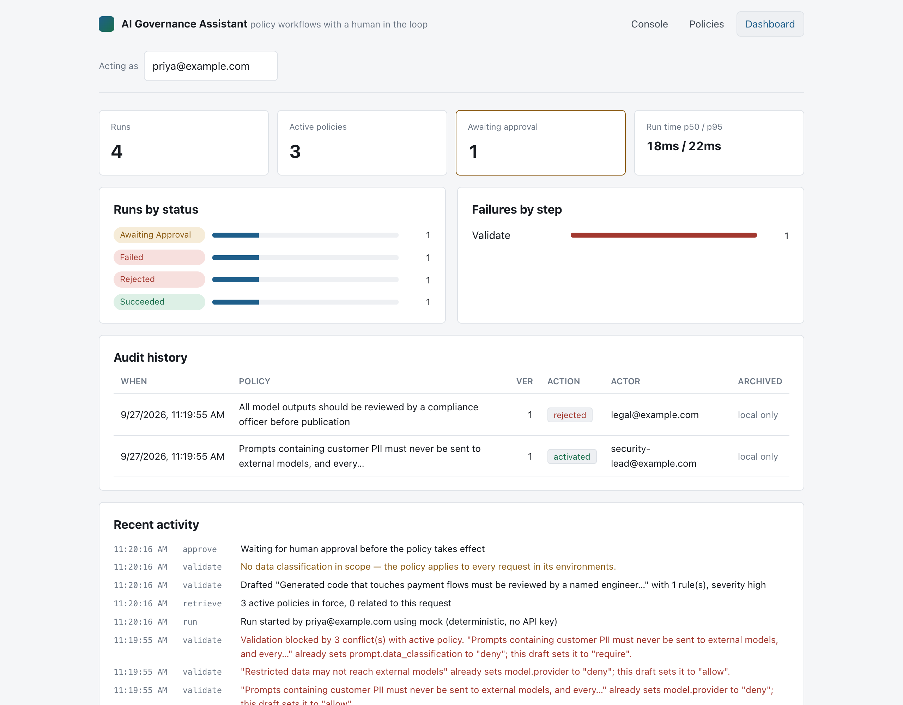
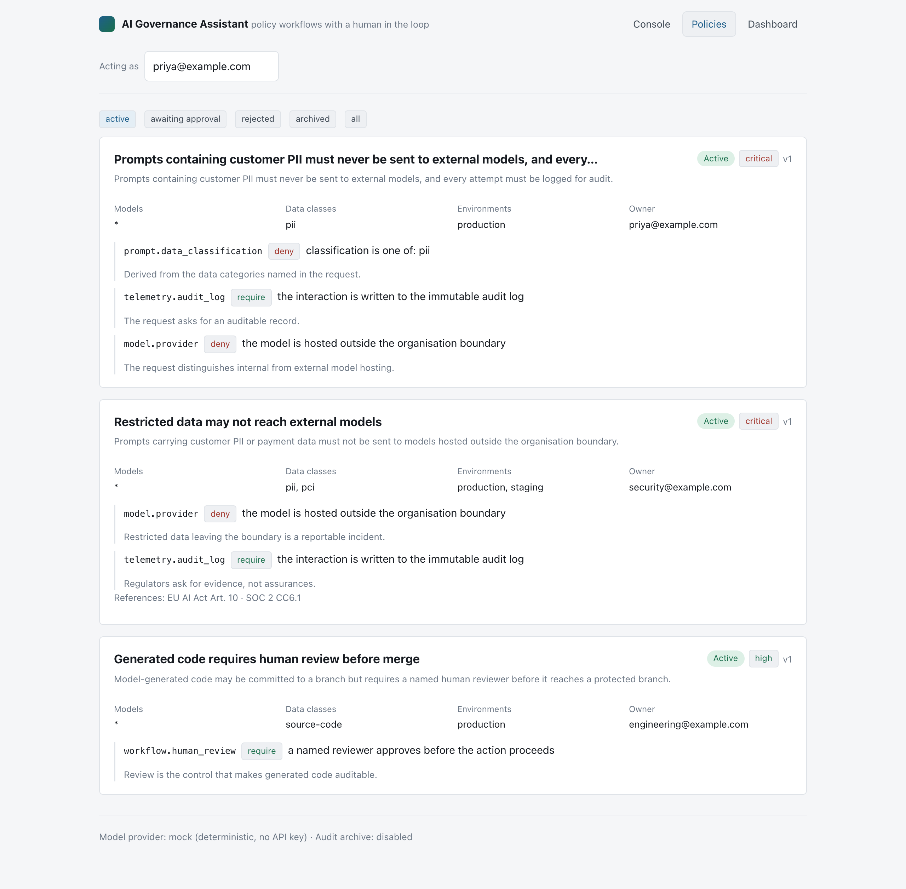

# AI Governance Assistant

Turn a plain-language governance request into a structured, validated, human-approved policy — and
keep a record of who decided what.

```
"No prompt containing customer PII may be sent to an external model."
                              │
                              ▼
     ┌────────────┐   ┌────────────┐   ┌────────────┐   ┌────────────┐
     │  retrieve  │──▶│  validate  │──▶│  approve   │──▶│  execute   │
     └────────────┘   └────────────┘   └─────┬──────┘   └────────────┘
      policies in      draft + check      HUMAN          activate,
      force            for conflicts      CHECKPOINT     write audit
```

Built with **React**, **TypeScript**, **Node.js**, the **Claude API**, and **AWS** (optional S3
archival of audit records).



---

## Why the checkpoint is the point

Plenty of systems will let a model write a config and apply it. The interesting engineering problem
in governance is the opposite: making sure it *cannot*, without a person saying so, and making that
decision auditable afterwards.

So the approval step here is a real stop, not a prompt. When a run reaches it:

- the run is persisted with status `awaiting_approval`
- **the process keeps no in-memory continuation** — no promise is parked, no timer is set
- a decision arriving ten minutes or ten days later, after a restart or from a different instance,
  reloads the run from the database and continues from exactly that point

That property is what makes the checkpoint a control rather than a speed bump, and it's why the
orchestrator is written as a resumable state machine instead of one long `async` function.

---

## Running it

```bash
npm install
npm run seed      # two active policies, so retrieval and conflict detection have something to do
npm run dev       # API on :4000, web on :5173
```

Open http://localhost:5173.

**No API key required.** With `ANTHROPIC_API_KEY` unset, the app uses a deterministic mock provider
and every part of the system still works end to end — orchestration, checkpoints, persistence,
conflict detection, the dashboard. Set a key and it uses Claude instead:

```bash
cp .env.example .env
# add ANTHROPIC_API_KEY=sk-ant-...
```

That split isn't a convenience shim. The orchestrator is written against an `LlmProvider`
interface, so the workflow is testable without network access or non-determinism — which is the
same reason you'd want the seam in production.

---

## What's in each layer

### Conversational policy drafting — `apps/api/src/llm/`

A natural-language request becomes a typed `PolicyDraft` via structured outputs:

```ts
const response = await this.client.messages.parse({
  model: 'claude-opus-5',
  system: DRAFTING_SYSTEM,
  messages: [{ role: 'user', content: request }],
  output_config: { format: zodOutputFormat(PolicyDraft) }
});
```

The schema is the same Zod object the API validates against and the UI renders, so the model's
output can't drift from what the rest of the system expects. `PolicyDraft` deliberately excludes
`id`, `version`, `status` and timestamps — the system owns those, and the model is never in a
position to invent them.

Conflict review runs as a second call with **adaptive thinking**, because comparing a draft against
a set of active policies is exactly the kind of reasoning that benefits from it.

### Agent orchestration — `apps/api/src/agent/orchestrator.ts`

Four steps, each recorded rather than inferred:

| Step | Does | Can fail on |
|---|---|---|
| `retrieve` | Loads active policies, finds ones bearing on the request | — |
| `validate` | Drafts the policy, reviews it for conflicts | A blocker conflict with active policy |
| `approve` | **Stops.** Waits for a named human | Rejection ends the run |
| `execute` | Activates, supersedes prior versions, writes audit | Archive or persistence failure |

A failed step marks the remaining steps `skipped` rather than leaving them `pending`, so a stalled
run and a failed one are never confused in the dashboard.

### Observability — `apps/web/src/views/Dashboard.tsx`




Run counts by status, **failures broken down by step**, p50/p95 run duration, the live event log,
and full audit history. The per-step failure breakdown is the number worth watching: a total
failure count tells you something is wrong, but failures concentrating in `validate` tells you
*what*.

Run progress streams to the console over SSE. Every frame is a complete snapshot rather than a
delta, so a dropped connection resolves itself on reconnect without the client tracking what it
missed.

### AWS — `apps/api/src/aws/audit-archive.ts`

On activation, the audit record is written to S3 under a date-partitioned key, so lifecycle rules
and Athena partitions work without a catalogue. Object Lock on the bucket is what actually enforces
immutability; the object metadata documents the intent.

Optional on purpose: with `AUDIT_ARCHIVE_BUCKET` unset the step is skipped and **the run's event log
says so**. An unconfigured bucket is a deployment choice, not a governance failure — but silently
not archiving would be.

---

## Layout

```
packages/shared/     Zod schemas + types shared by both apps — one definition of a policy
apps/api/
  agent/             The four-step orchestrator and its resumable checkpoint
  llm/               Provider interface, Claude implementation, deterministic mock
  aws/               S3 audit archival
  db.ts              SQLite persistence, SQL confined to one file
apps/web/
  views/Console      Request → structured policy, with live run progress
  views/RunTimeline  Step-by-step state, the approval control, event log
  views/Dashboard    Status, failures by step, latency, audit history
  views/Policies     The policy register
```

## Design decisions worth knowing

**SQLite, not Postgres.** The repo should run in one command. The persistence layer is small and
behind helpers, so swapping the driver touches one file.



**Policies are versioned by supersession.** Activating a policy whose name matches an active one
archives the old version and increments — governance policies get amended, not duplicated, and the
audit trail has to show the chain.

**The reviewer identity is an editable field.** In a deployment that comes from SSO. Here it's
editable so the approval path can be demonstrated as two different people without an auth flow
standing in the way.

**Rejection is a first-class outcome.** It writes an audit record, marks the policy `rejected`, and
skips execution. A governance system where "no" is an untracked path isn't one.

## Scripts

| Command | Does |
|---|---|
| `npm run dev` | Both apps |
| `npm run dev:api` / `dev:web` | One at a time |
| `npm run seed` | Two active policies to work against |
| `npm run typecheck` | Both projects, strict |
| `npm run build` | Production build |
